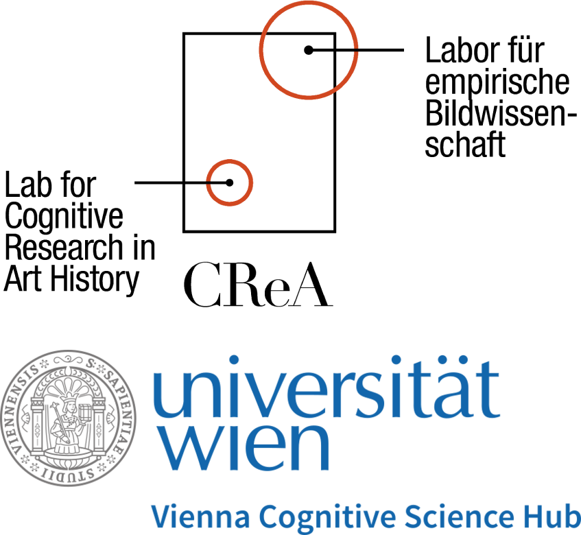
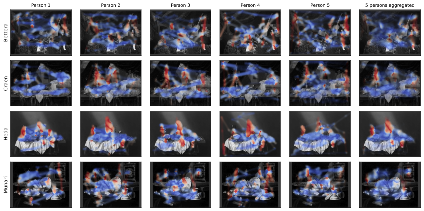

# HeatMatch

<table border="0" cellspacing="0" cellpadding="0"><tr>
<td width="72%" valign="top">

Python implementation accompanying the paper:

<blockquote>
Xingyu Long, Jozsef Arato, Sophia Kury, Anna Miscena, and Raphael Rosenberg. 2026.<br/>
<strong>HeatMatch: Orientation-Aware Visualization and Comparison of Very Dense Saccade Patterns.</strong><br/>
<em>Proceedings of the ACM on Computer Graphics and Interactive Techniques</em> (PACMCGIT), 9(2), Article 18.<br/>
<a href="https://doi.org/10.1145/3803539">https://doi.org/10.1145/3803539</a>
</blockquote>

</td>
<td width="28%" align="center" valign="middle">

</td>
</tr></table>

---

## Overview

1. **OOI-coded heatmaps** — orientation fields visualized with researcher-defined color anchors and confidence-weighted opacity.
2. **HeatMatch similarity** — composite score *S* = (*S*_loc + *S*_dir) / 2 comparing saccade density and orientation.


<sub>Per-participant (columns 1–5) and aggregated (column 6) heatmaps for four paintings. Hue = mean saccade orientation relative to OOI; opacity = local confidence. Stimulus images: public domain via [Wikimedia Commons](https://commons.wikimedia.org) — see paper for details.</sub>

See the [paper](https://doi.org/10.1145/3803539) for methodology.

---

## Installation

```bash
git clone https://github.com/xysLong/HeatMatch.git
cd HeatMatch
pip install -e .
```

Dependencies: `numpy`, `matplotlib`, `Pillow` (see `pyproject.toml`).

---

## Quick Start

```python
import matplotlib.pyplot as plt
from heatmatch import make_reference_grid, make_orientation_field, Heatmap, compute_similarity

W, H = 2880, 2160
onset  = ...  # (J, 2) saccade start coordinates
offset = ...  # (J, 2) saccade end coordinates

pts, xx, yy = make_reference_grid(W, H, grid_resolution=200)
field = make_orientation_field(pts, onset, offset, sigma=50.0, grid_shape=yy.shape)

fig, ax = plt.subplots()
Heatmap(field, W, H).draw(ax, ooi=0.0)  # ooi=0 → horizontal, ooi=90 → vertical
plt.show()

# Compare two patterns
result = compute_similarity(field_a, field_b)
print(result.s_loc, result.s_dir)
```

A full worked example is in [`demo.ipynb`](demo.ipynb). The dataset is not included — download `data_anonymized.csv` from **[osf.io/f2xhj](https://osf.io/f2xhj/)** and place it in `tests/`.

---

## API

### `heatmatch.fields`

| | |
|---|---|
| `make_reference_grid(w, h, grid_resolution)` | Returns `(pts, xx, yy)`; int → square grid, `(ny, nx)` tuple → rectangular |
| `make_orientation_field(pts, onset, offset, sigma, grid_shape, ...)` | Returns `OrientationField` with `omega_mean`, `R`, `rho` — Eqs. (2)–(4) |

### `heatmatch.heatmapping`

| | |
|---|---|
| `Heatmap(field, w, h, image=None)` | Caches colormap, opacity, and (optionally) grayscale background image |
| `Heatmap.draw(ax, ooi, opacity_density_weight, base_opacity, cmap, ...)` | Renders onto `ax` — §3.2 |

OOI in degrees: 0 = east, 90 = north, 180 = west, 270 = south. Unsigned, so `ooi` and `ooi ± 180` are equivalent.

### `heatmatch.matching`

| | |
|---|---|
| `compute_similarity(field_a, field_b, density_coherence_tradeoff)` | Returns `SimilarityResult(s_loc, s_dir)` — Eqs. (5)–(6) |

---

## Key Parameters

| Parameter | Default | Notes |
|---|---|---|
| `sigma` | `50.0` | Gaussian bandwidth in px. Paper evaluates {50, 100, 150}. |
| `grid_resolution` | `200` | Int or `(ny, nx)`. Paper uses 200. |
| `ooi` | `0.0` | Orientation of Interest in degrees. |
| `opacity_density_weight` | `1.0` | Density vs. coherence for opacity. Recommended 0.5–1.0. |
| `base_opacity` | `0.85` | Global opacity ceiling; useful with a background image. |
| `density_coherence_tradeoff` | `0.5` | Density vs. coherence for *S*_dir. At 1.0, angular information is discarded. |

---

## Citation

```bibtex
@article{long2026heatmatch,
  author    = {Long, Xingyu and Arato, Jozsef and Kury, Sophia and Miscena, Anna and Rosenberg, Raphael},
  title     = {HeatMatch: Orientation-Aware Visualization and Comparison of Very Dense Saccade Patterns},
  journal   = {Proc. ACM Comput. Graph. Interact. Tech.},
  year      = {2026},
  volume    = {9},
  number    = {2},
  articleno = {18},
  doi       = {10.1145/3803539},
}
```
